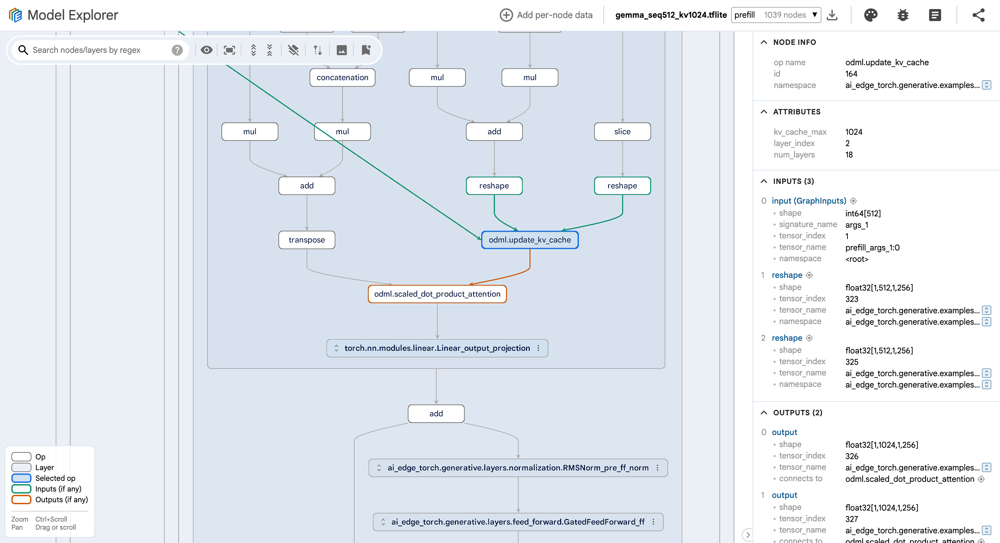

# AI Edge Torch Generative API

Our Generative API library provides PyTorch native building blocks for composing Transformer models such as [Gemma](examples/gemma), [TinyLlama](examples/tiny_llama) and [others](examples/) using mobile-friendly abstractions, through which we can guarantee conversion, and performant execution on our mobile runtime, [TensorFlow Lite](https://ai.google.dev/edge/lite).

Before proceeding, please note:
* This is only v0.1 of the API, an early developer preview in the interest of developing openly in the community.
* The API is unstable, and we expect it to change over the next several months.
* The library is in early development. Please expect rough edges. Some [known issues](#known-issues) are listed below.

## System Overview

The system is designed to help ML practitioners deploy their trained Large Language Models on mobile devices using the TFLite runtime. It assumes the user already has a trained model they are happy with, and is optimized for mobile inference.

* Start with a trained PyTorch Large Language Model. You can choose any off the shelf model from huggingface.co, kaggle.com, or bring your own PyTorch model.
* [Re-author](#model-authoring-using-edge-generative-api) the model using the Edge Generative API. If our [examples](examples/) already contain it, it can save you time.
* [Quantize](#quantization) the model using our Quantization APIs. This is critical for reducing model size, and achieving reasonable performance.
* Verify the model implementation, and quality using your model evaluation pipeline, including pre/post-processing steps for the LLM pipeline.
* [Convert](#convert-pytorch-llm-to-a-tflite-model) the model, and get a TFLite Flatbuffer representing the mobile model.
* Choose either approach below to deploy the end to end [LLM Inference Pipeline](#end-to-end-inference-pipeline).

For a more detailed explaination of how the system works, please refer to the [System Overview](doc/system_overview.md).

### Model Authoring using Edge Generative API

The library provides basic [building blocks](generative/layers) for common transformer models (encoder only, decoder only, or encoder-decoder style). As a mobile App developer who wants to integrate LLMs or transformer models into your Android or iOS app, you can re-author your PyTorch Large Language Model using these layers.

See our [examples](examples/README.md), which explain in detail how to re-compose popular architectures like [Gemma](examples/gemma), [TinyLlama](examples/tiny_llama), and [Phi-2](examples/phi2) using the library. To do so, you need to have an understanding of the model structure (attention mechanism used, MLP layers) and also be familiar with writing PyTorch code. Our examples should help you get familiar with the process.
<br/>

### Quantization

Quantization can be done via the API exposed in [quantize](quantize/). To apply quantization, we need to create a configuration that fully expresses how the model should be quantized. This configuration is then passed into conversion, generating a quantized model.

`quant_recipes.py` contains a list of recipes that are known to be well-supported during runtime. For the average user, this is a good starting point to select the quantization scheme that is best suited for your deployment needs. After identifying the target recipe, the model can be quantized as follows. This example is extracted from `generative/examples/quantize/example.py`.

```
quant_config = quant_recipes.full_int8_dynamic_recipe()
edge_model = ai_edge_torch.convert(
    model, (tokens, input_pos), quant_config=quant_config
)
```

Once converted, you will get a quantized `.tflite` model which will be ready for on-device execution.

#### Supported schemes

In the current release, the following schemes are supported:

* Dynamic range quantization with FP32 activations and INT8 weights for linear ops
* FP16 quantization with FP16 weights and FP32 activations and computation for all ops

These correspond to the available recipes in `quant_recipes.py`
<br/>

### Convert PyTorch LLM to a TFLite model

Once you re-author the model and validate its numerical accuracy, you can convert the `nn.Module` to TFLite format. Usually for LLMs, there are two entry functions (signatures) we can export: `prefill` and `decode`. Those two signatures only differ in the shape of arguments.

For example, in the `generative/examples/test_models/toy_model_with_kv_cache.py`, you can define inputs for both signatures:

Sample inputs for the `prefill` signature:
https://github.com/google-ai-edge/ai-edge-torch/blob/853301630f2b2455bd2e2f73d8a47e1a1534c91c/ai_edge_torch/generative/examples/test_models/toy_model_with_kv_cache.py#L105-L108

Sample inputs for the `decode` signature:
https://github.com/google-ai-edge/ai-edge-torch/blob/853301630f2b2455bd2e2f73d8a47e1a1534c91c/ai_edge_torch/generative/examples/test_models/toy_model_with_kv_cache.py#L111-L114

Then export the model to TFLite with:
https://github.com/google-ai-edge/ai-edge-torch/blob/853301630f2b2455bd2e2f73d8a47e1a1534c91c/ai_edge_torch/generative/examples/test_models/toy_model_with_kv_cache.py#L133-L139

Please note that using the `prefill` and `decode` method conventions are required for easy integration into the Mediapipe LLM Inference API.
<br/>

### End-to-End Inference Pipeline

The model files typically only perform the core ML computation in the LLM pipeline. Deploying the full pipeline requires handling tokenization, sampling and any other pre or post-processing steps required by your system. There are two ways to deploy the converted LLMs on device as part of a full LLM Inference Pipeline.

#### Use TFLite Runtime APIs

The user needs to implement the entire LLM Pipeline themselves, and call TFLite Runtime APIs directly to invoke the model. A text generation pipeline typically requires a tokenizer/detokenizer and a sampler, in addition to model inference. The tokenizer converts the input text from a string to a list of integers. The `prefill` signature ingests the sequence of input tokens, and the `decode` signature is invoked to obtain a tensor of logits. The sampler selects a token based on the provided logits, and the decode loop is repeated autoregressively. Ultimately, the detokenizer maps the generated tokens back into human-readable text.

This approach provides users with the most control. For example, they can implement streaming, get more control over system memory or implement advanced features such as constrained grammar decoding, speculative decoding etc.

A very simple text generation pipeline based on a decoder-only-transformer is provided [here](https://github.com/google-ai-edge/ai-edge-torch/blob/main/ai_edge_torch/generative/examples/cpp/text_generator_main.cc) for reference. Note that this example serves as a starting point, and users are expected to implement their own pipelines based on their model's specific requirements.

#### Use MediaPipe LLM Inference API

The [MediaPipe LLM Inference API](http://ai.google.dev/edge/mediapipe/solutions/genai/llm_inference) is a high-level API which supports LLM Inference using a prompt-in/prompt-out interface. While it supports some models "out of the box", you can also provide it LLMs converted via our Generative API, and get access to a simple high level interface with Java, and Swift bindings to easily integrate with Mobile Apps. It takes care of all the complexity of implementing the LLM pipeline under the hood, and makes deployment much easier. Unless, you want to explicitly control the pipeline, we would recommend using this for robustness, and ease of use.

To deploy using the MP LLM Inference API, you need to
* Ensure you convert models using the expected convention of `prefill`, and `decode` functions in the examples. The pipeline only supports `SentencePiece` tokenizer, but it can support a wide variety of models.
* Bundle the converted TFLite files along with some other configurations such as start/stop tokens, tokenizer model etc. See [here](http://ai.google.dev/edge/mediapipe/solutions/genai/llm_inference#ai_edge_model_conversion)
* Once the bundle is created, you can easily invoke the pipeline using the mobile APIs [here](https://ai.google.dev/edge/mediapipe/solutions/genai/llm_inference/android#create_the_task).

#### Tokenizer

The bundle files used by MediaPipe LLM Interface API require SentencePiece model
protobuf files as the tokenizer model. Many PyTorch models don't provide
SentencePiece model protobuf files when they uses BPE tokenization. In that
case, SentencePiece model protobuf files can be built from tokenizer config json
files. `generative/tools/tokenizer_to_sentencepiece.py` might be enough to do it
though the generated SentencePiece model would not output the same token IDs for
all input strings. For example, the SentencePiece model of Llama3.2 built by
`generative/tools/tokenizer_to_sentencepiece.py` outputs token IDs mismatched
with ones by the original BPE tokenizer around by 1%.

```
python tokenizer_to_sentencepiece.py \
    --checkpoint=meta-llama/Llama-3.2-3B-Instruct \
    --output_path=llama3.spm.model
...
I1011 tokenizer_to_sentencepiece.py:203] Not matched strictly 35/1000 pairs: 3.50%, loosely 9/1000 pairs: 0.90%
I1011 tokenizer_to_sentencepiece.py:274] Writing the SentencePieceModel protobuf file to: llama3.spm.model
```

<br/>

## Model visualization
### Install the Model Explorer package using the following command:
```
pip install ai-edge-model-explorer
```
Detailed install instruction can be found [here](https://github.com/google-ai-edge/model-explorer/wiki/1.-Installation).

### Visualize the model using CLI
```
model-explorer 'gemma_seq512_kv1024.tflite'
```



For an end-to-end example showing how to author, convert, quantize and execute, please refer to the steps [here](https://github.com/google-ai-edge/ai-edge-torch/blob/main/ai_edge_torch/generative/examples/README.md)
<br/>

## What to expect

### Future Roadmap
* Expanded accleration support on mobile, and web GPUs, and mobile NPUs.
* Advanced quantization approaches suitable for LLMs.
* Expanded support of models, including Diffusion models.
* LoRA support.

### Known Issues
The following are known product issues we are actively working to fix.

* The conversion, and serialization process is unoptimized for LLMs. It requires keeping multiple copies of the weights in memory for transformations, and serialization/deserialization. For an optimal conversion flow, use Colab Pro or a powerful Linux workstation (or cloud instance) with at least 32GB of RAM.
* Runtime execution of the LLM in TFLite is missing some memory optimizations, and inefficient during memory unpacking on XNNPack.
