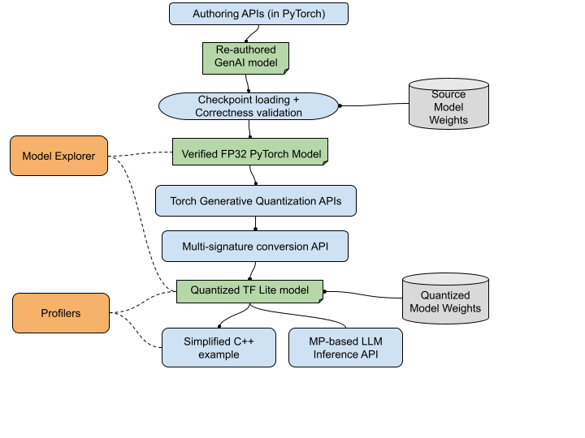

# AI Edge Torch Generative API System Architecture Overview

This document aims to provide a technical deep dive of the AI Edge Torch Generative API, discuss its design considerations, system architecture and major components, current limitations, and future plans for improved system health, usability and performance.

## Main objective

The rising popularity of Large Language Models (LLMs) and Large Generative Models (LGMs) has led to their widespread adoption across various applications, both in the cloud and on-device.  On-device deployment of smaller language models (SLMs) offers distinct advantages, including enhanced privacy, quicker response times, and reduced maintenance costs. However, optimizing LLMs for efficient on-device performance often requires complex techniques like model quantization, numerical debugging, quality assessment, performance tuning, and seamless integration with production environments such as Android/iOS apps or web platforms. To address these challenges, we've introduced the AI Edge Torch Generative API, a comprehensive end-to-end solution designed to simplify the deployment process. Please note that the library is actively under development, and the API interface may evolve in the coming months.

## Key design considerations

There are several key design directions for the project we want to highlight:
* **Easy authoring experience**. We want to adopt a PyTorch-centric approach for users to author/re-author their Generative AI models in our library. This will be critical to make the authoring process easy and light-weight.
* **Better tooling integration**. Support model visualization for both PyTorch and TF Lite, so that users can trace/compare models before/after conversion to figure out potential issues. And also have on-device benchmarking / evaluation tools to help triage performance or model quality issues.
* **Great performance out-of-the-box**. We want to provide great OOB performance for common Generative AI models across a variety of hardware acceleators.
* **Easy accelerator support**. Make it easy to support newer hardware accelerators and bring down the cost of adding new xPU support. This means the layer design, conversion process and on-device runtime need to be easily extensible.
* **Multiple framework support**. Allow users to author models in main ML frameworks such as PyTorch or Jax (future).
* **Build on top of TF Lite runtime**. TF Lite is widely adopted for mobile ML inference, and is integrated into the Google play services on Android. This means less friction in runtime deployments and familiar APIs.

## Overall System Architecture

On a high level, the library is composed of the following major components:
1) Authoring/Re-authoring library (with initial support in PyTorch).
2) Checkpoint loading APIs (weight remapping).
3) Quantization APIs.
4) Conversion flow.
5) Multi-signature conversion API.
6) Composite op lowering via high-level function boundary.
7) On-device execution via TF Lite and delegate system.
8) End-to-end Pipeline APIs (MediaPipe-based or pure C++ inference).
9) Model visualization and profiling tools.

Below is an overview of the main components and user flow.

## Detailed design

In this section, we will give a more in-depth view for the main components of the system.

### Authoring/Re-authoring library

The user journey of the Edge Generative API begins from the authoring library. The authoring library provides basic building blocks for common generative AI models (from LLMs to diffusion models), and users can leverage those building blocks to author their own custom generative models and achieve great out-of-the-box performance. 

#### Motivation for the PyTorch building blocks

During our initial investigation, we found that although there are many open-source PyTorch implementation of common LLM models (e.g. Llama), it's pretty difficult to convert those models from source program to the TF Lite format, and achieve good performance. Those difficulties might include:

1) **Not able to be exported by Torch Dynamo**. The PyTorch 2.0 compiler uses Torch Dynamo under-the-hood to perform graph capturing (tracing a PyTorch `nn.Module` and convert it to a full graph representation with Aten operations). For an arbitrary PyTorch model, dynamo may fail during full graph export. Re-writing the model to be dynamo exportable usually takes some non-trivial work and may need a deep understanding of the compiler stack.
2) **Not able to be converted by AI edge torch**. AI edge torch converter utilizes TorchXLA, StableHLO and TF Lite converter to convert the Aten graph to TF Lite model format. During this process, it may fail if the source FX graph has certain graph patterns / ops that are not supported by the converter. As the conversion will go through multiple stages, it's very difficult to triage and fix the conversion issue (either fixing the model itself or converter stack) for most users with little compiler knowledge.
3) **Difficult to achieve good OOB performance**. Even you may get lucky and successfully make it through the TF Lite model format, there is also no guarantee that the model will run performantly on device, and be able to leverage the on-device accelerators such as XNNPack, GPU or NPUs. For example, performance critical layers such as KV Cache and SDPA need to be handlded specifically in the converter and runtime to ensure it can be accelerated.
4) **Applying quantization consistently is difficult**. It's difficult to specify quantization receipes in a consistent way for an arbitrary PyTorch generative AI model. For ODML, we need to carefully co-design our custom building blocks and AI Edge quantizer to ensure they work smoothly together, and is easy to configure with custom quantization receipes without noticiable model quality drop.
5) **Many OSS models are not designed / optimized for mobile execution**. For example, those implementations may contain distributed training logic, CUDA dependencies, and tensor parallel optimizations for fast training. Models usually need to be rewritten to remove those pieces before exporting to mobile.

We've also observed that solutions like `llama.cpp` and `gemma.cpp` have gained traction within the open-source community. These tools enable developers to directly implement model inference in C++, offering a streamlined approach with minimal dependencies and great performance. However, these solutions may present certain drawbacks:
1) **Poor debuggability**. It's not easy to step into the C++ inference logic to debug numerical or performance issues. It usually requires a lot of manual debugging work and lack enough tooling support. Also model visualization tools (e.g. Model Explorer, or Netron) won't work for those C++ based solutions.
2) **Requires deep expertise in runtime and low-level kernel optimizations**. E.g. models written this way are deeply coupled with kernel libraries (e.g. Highway, XNNPack, OpenCL etc) which are diffcult to optimize/implement for most mobile developers. You will need to have sufficient knowledge in those kernel libraries to make performance improvements.
3) **Difficult to scale to new model architectures**. Since those solutions apply the "model as code" idea, the implementation itself is usually very customized to a specific model architecture (e.g. Llama2) and hard to generalize to new models in the future. The flexibility to configure and customize is usually very limited.
4) **Difficult to support accelerators**. LLMs and generative models usually require GPU/NPU/TPU acceleration to ensure they can achieve the best performance and power efficiency. It's especially critical to leverage those acclerators in mobile environments since edge devices are very resource contrained. We need an extensible approach to enable new accelerator support.

With those considerations and observations, we propose a set of PyTorch building blocks for common generative models with deep mobile optimizations. Those layers provide nice properties such as:
1) **Easy to compose**. Since they are implemented using native PyTorch ops and APIs, most PyTorch users can understand and compose with them with less effort.
2) **Easy to debug**. We provide tooling such as Model explorer to allow visualization of the PyTorch or TF Lite models. It's much easier to understand model architecture, and layer composition with the help of those tools.
3) **Convertibility guarantee**. Since we carefully designed and implemented those building blocks, models composed via those blocks can be easily converted to TF Lite format.
4) **Performance guarantee**. Those layers are implemented to ensure best performance on mobile hardwares (CPU, GPU, NPUs) as they carry high-level function boundary information to leverage highly performant fused kernels.
5) **Easy to quantize**. Paired with the AI Edge quantization APIs, users can easily specify custom quantization receipes for the models.
6) **Scalability to new model architectures**. The layers are designed with cleanly separated interfaces, and are highly reusable and customizable to support any new Generative models. Users can also contribute new building blocks to the layer library to support any missing features.
7) **Easy to support ML accelerators**. We provide basic mechanisms such as high-level function boundary(HLFB), fx graph rewrite passes and delegate system for easy accelerator integration.

For more documentation on the layer design, please refer to [this page](https://github.com/google-ai-edge/ai-edge-torch/tree/main/ai_edge_torch/generative/layers).

### Checkpoint loading APIs

Due to the tensor name mismatch between the original and re-authored model, we need to remap the original checkpoint to the new model. For detailed steps please see this [doc](https://github.com/google-ai-edge/ai-edge-torch/tree/main/ai_edge_torch/generative/examples#checkpoint-mappingloading).

For now, the library partially automates weight remapping with some helper functions provided in the [ModelLoader](https://github.com/google-ai-edge/ai-edge-torch/blob/9b06abe7c645f1d784804eb7f63f93458f358ba1/ai_edge_torch/generative/utilities/loader.py#L95). We will continue to improve the model loading APIs to reduce the manual work involved in weight remapping.

### Quantization APIs

TODO: fill in this part.

### Conversion flow

With AI edge torch generative API, it adopts the same PyTorch to TF Lite conversion flow as traditional models. On a high level, it involves the following steps:
1) PyTorch compiler (Dynamo). We leverage [Torch Dynamo](https://pytorch.org/docs/stable/torch.compiler_deepdive.html) which is the official graph compiler for PyTorch 2.0. It performs graph capturing and exports the PyTorch `nn.Module` to an FX graph with Aten operations.
2) TorchXLA. For the moment, we are using [Torch/XLA](https://github.com/pytorch/xla) to compile the FX graph to Stable HLO graph. The converted graph will be stored as a Tensorflow SavedModel.
3) TF Lite MLIR converter. The TF Lite converter will consume the SavedModel with StableHLO ops, and further lower it down to TF Lite ops.

To convert a several billion parameters Generative AI model, it usually takes a lot of CPU and RAM resources on your machine, as the converter does all kinds of graph optimizations and transformations to ensure the converted model is highly optimized. Going forward, we will continue to improve the converter infrastructure to reduce its system overhead.

### Multi-signature conversion API

Generative AI models usually have large weights (a few hundred MBs or up to GBs for SLM), and it may have different calling function like `Prefill` or `Decode`. Depending on the model, those different entry functions may also reference the same set of weights during the forward pass. If we converted those entry functions separately, we may notice that the converted TF Lite models have lots of duplicated weights, which will make it impossible for on-device deployment. By leveraging the [multi-signature conversion API in TF Lite converter](https://www.tensorflow.org/lite/guide/signatures), we can achieve the following benefits:
* Single flatbuffer file with multiple entry points (called `Signatures`).
* Weights are automatically de-duped and shared across `Signatures`.
* User or high-level library code can easily call into the [signature invocaction APIs](https://www.tensorflow.org/lite/guide/signatures#run_signatures).
* Ability to pack different `nn.Modules` converted graphs into the same flatbuffer model for single-file deployment (e.g. different components in stable diffusion model).

For code examples, please refer to [this](https://github.com/google-ai-edge/ai-edge-torch/tree/main/ai_edge_torch/generative#convert-pytorch-llm-to-a-tflite-model) to learn how to use multi-signature conversion API.

### Composite op lowering via high-level function boundary

To address the performance issues of LLM, we identified that the model's forward pass is usually bottlenecked by a few key operations, such as KV cache or scaled dot product attention. As the converter traces the whole model and performs graph lowering through Aten/CoreAten/StableHLO etc, there are chances that certain op groups are not properly fused together, resulting in bad runtime performance. For example, we leverage PyTorch's [SDPA](https://pytorch.org/docs/stable/generated/torch.nn.functional.scaled_dot_product_attention.html) to implement attention computation, however it will be converted to less efficient form when converting directly (which leads to unncessary FLOPs). The core problem here is that the converter doesn't know the boundary of a `SDPA` op so it can't apply any optimizations on it. We use TorchXLA's high-level function boundary API to mark the boundary of the `SDPA` operation, and then lower it to TF Lite custom op. For example, see how HLFB is applied inside the `SDPA` python implementation:
https://github.com/google-ai-edge/ai-edge-torch/blob/9b06abe7c645f1d784804eb7f63f93458f358ba1/ai_edge_torch/generative/layers/scaled_dot_product_attention.py#L69-L117

As a result, everything in between the `builder.mark_inputs` and `builder.mark_outputs` call will be wrapped inside a StableHLO composite op named `odml.scaled_dot_product_attention`, and map to TF Lite's [SDPA custom op](https://github.com/tensorflow/tensorflow/blob/master/tensorflow/lite/experimental/genai/sdpa.cc) by the converter. During runtime, the delegate will match and replace the `odml.scaled_dot_product_attention` to the most efficient kernels on that delegate backend.

### On-device execution via TF Lite runtime and the delegate system

TF Lite supports a broad range of hardware accelerators via its on-device [delegation system](https://www.tensorflow.org/lite/performance/delegates). On CPU, we leverage the [XNNPack library](https://github.com/google/XNNPACK) and the [TF Lite XNNPack delegate](https://github.com/tensorflow/tensorflow/blob/master/tensorflow/lite/delegates/xnnpack/README.md) to accelerate generative models on-device. In the future, we will broaden the support for GPU, TPUs and other NPUs.

#### How to achieve speed up

When calling `ModifyGraphWithDelegate` API, TF Lite delegate will traverse the model and see which parts of the model is compatible. For `SDPA` op, the XNNPack delegate will match the op based on its name and construct an XNNPack computation subgraph to accelerate attention calculation. See [VisitScaledDotAttentionCompositeNode](https://github.com/tensorflow/tensorflow/blob/dea0e2a6f8beca190ca138093e669d42ee244056/tensorflow/lite/delegates/xnnpack/xnnpack_delegate.cc#L6625) in TF Lite's XNNPack delegate for how it handles the `SDPA` computation.

#### Runtime memory savings & Reduced warmup time

Achieving low peak memory usage is also very critical for on-device generative AI model execution. To this end, we have implemented several optimizations in the current  TF Lite and XNNPack delegate to reduce overall memory consumption:
* **XNNPack weight cache**. Internally the delegate will repack the weights into a central weight cache, to allow for weight sharing across different signatures. See this [blog post](https://blog.tensorflow.org/2022/06/memory-efficient-inference-with-xnnpack.html) for more details.
* **XNNPack weight serialization**. The weight cache can be automatically serialized to a local file which the delegate could quickly reload later, this will greatly reduce the warmup time on the second inference.

### End-to-end Pipeline APIs (MediaPipe-based or pure C++ inference)

TODO: finish this up.

### Model visualization and profiling tools

For now, we are using Model Explorer and the TF Lite benchmarking tools to visualize and profile model performance. Please refer to [Model Explorer](https://ai.google.dev/edge/model-explorer) and [TF Lite benchmarking tools](https://www.tensorflow.org/lite/performance/measurement) to learn how to leverage those tools for a better debugging experience. 